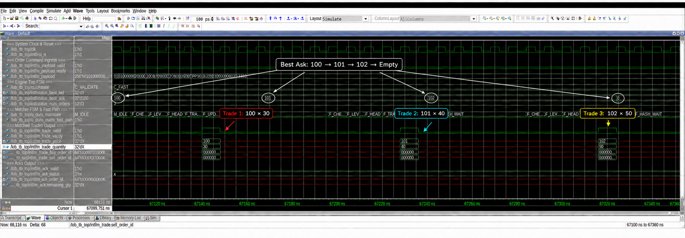

# FPGA Limit Order Book

A hardware-accelerated, price-time-priority limit order book for the Xilinx
Artix-7 FPGA family. The repository contains synthesizable SystemVerilog, a
byte-compatible Python golden model, deterministic stimulus generation, RTL
and UVM verification, and Ethernet/UDP integration for the ALIENTEK DaVinci
Pro board.

The protocol uses fixed 32-byte, big-endian messages for add, cancel, modify
and execute events. The Python model and RTL consume the same wire format.

## Architecture

The Python model and the RTL consume the same 32-byte wire format, so a
deterministic software order flow can drive the FPGA directly over UDP, and
the same flow can be replayed by the UVM scoreboard to check every trade and
acknowledgement against the golden model.


The live board path receives an order over RGMII/UDP, decodes and routes it
through the matching engine, then returns execution reports and a command
acknowledgement to the Python host.

## Features

- Price-time-priority matching with add, cancel, modify and execute commands
- Up to 8,191 simultaneously live orders
- 4,096 price levels and a four-way set-associative order-ID table
- UDP/IPv4/Ethernet board interface with acknowledgements and trade reports
- Deterministic Python golden model and stress-test generator
- Portable Python and Icarus Verilog tests
- Vivado build scripts and a Questa UVM verification environment

## Matching paths

The matcher reaches a trade in two ways. A new crossing ADD takes the fast
path and is matched before any remainder is stored. If an ADD or a
price-changing MODIFY leaves the live book crossed, the drain path removes
crossed orders directly until the book is consistent again.


## Order-book storage

Persistent state is split across a fixed-slot order pool, per-price FIFO
queues, a four-way set-associative order-ID index and a best-price tracker.
This keeps price-time priority and avoids software-style pointer chasing.


## Repository layout

```text
.
├── hardware/
│   ├── rtl/          Core LOB and Ethernet/UDP RTL
│   ├── board/        DaVinci Pro integration
│   ├── constraints/  Board pin and timing constraints
│   ├── sim/          Portable RTL testbench
│   ├── verif/        Questa UVM environment
│   └── tools/        Vivado and board-control scripts
├── software/
│   ├── lob/          Python model, protocol and UDP tools
│   └── tests/        Unit, stress and loopback tests
└── docs/                 Architecture and interface specifications
```

## Quick start

Install the portable development dependencies and run both the Python and RTL
tests:

```bash
python3 -m venv .venv
source .venv/bin/activate
python -m pip install --upgrade pip
python -m pip install -e './software[dev]'
make test
```

The suite requires Python 3.10 or newer and Icarus Verilog. See the
[development and reproducibility guide](docs/development.md) for tested tool
versions, Vivado synthesis, bitstream generation and Questa setup.

Run the Python demonstration separately with:

```bash
make -C software demo
```

## Verification

The Questa UVM environment replays the same 32-byte stimulus as the Python
golden model and checks trades, execution reports, acknowledgements and the
final book snapshot. This sweep shows three consecutive fills advancing the
best ask from 100 through 102 and finally to an empty sell side.



## FPGA build

Build the standalone core or the complete DaVinci Pro bitstream with Vivado:

```bash
make synth
make bitstream
```

The board build defaults to `XC7A100T-2FGG484`. See the
[board guide](hardware/board/README.md) for network settings, programming and
hardware tests.

## Documentation

- [Architecture Overview](docs/architecture.md)
- [Protocol Specification](docs/01_protocol_spec.md)
- [Memory Architecture](docs/04_memory_architecture.md)
- [RTL Interface Specification](docs/03_rtl_interface_spec.md)
- [UVM Verification Interface](docs/05_uvm_verification_interface.md)
- [Development and Reproducibility](docs/development.md)

## Project status

This is a research and educational FPGA implementation, not a production
exchange system. Protocol version 1 is frozen; incompatible wire-format
changes require a version increment.

## License

Released under the [MIT License](LICENSE).
